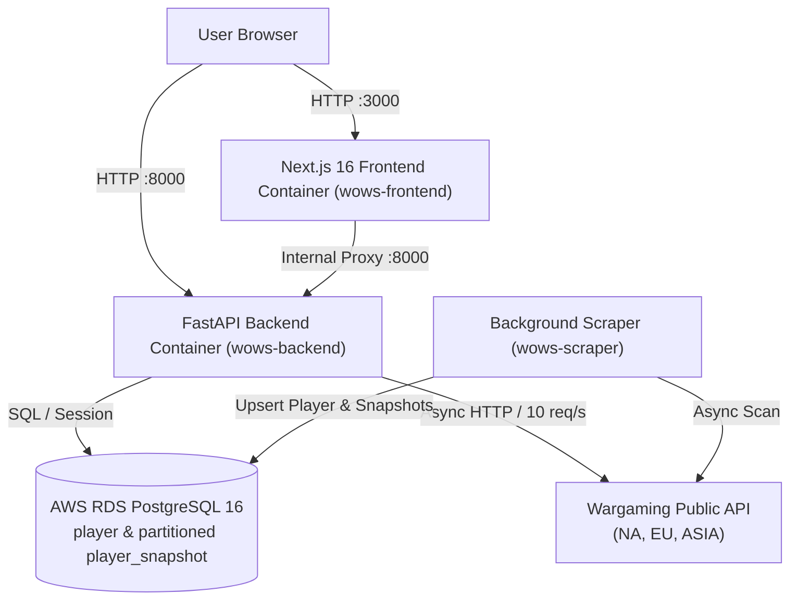

# Production Deployment & Operations Guide

This guide covers operational access, architecture, and deployment procedures for the World of Warships Stats Tracker on AWS.

## Quick Reference Links (Production Server)

| Service | Endpoint | Description |
| :--- | :--- | :--- |
| **Web Application** | [http://44.253.134.12:3000](http://44.253.134.12:3000) | Next.js 16 Neon Tactical UI & Charts |
| **Backend API (Swagger Docs)** | [http://44.253.134.12:8000/docs](http://44.253.134.12:8000/docs) | Interactive OpenAPI / Swagger UI |
| **API Health Check** | [http://44.253.134.12:8000/health](http://44.253.134.12:8000/health) | Uptime & health verification (`{"status":"healthy"}`) |
| **Overview Aggregate API** | [http://44.253.134.12:8000/api/stats/overview](http://44.253.134.12:8000/api/stats/overview) | Global player & battle summary counters |
| **OpenAPI Schema** | [http://44.253.134.12:8000/openapi.json](http://44.253.134.12:8000/openapi.json) | Raw OpenAPI v3 specification |

---

## AWS Infrastructure Details

- **EC2 Instance:** `t3.medium` (Ubuntu 24.04 LTS) in `us-west-2` (Oregon)
- **Elastic IP (Static):** `44.253.134.12` (Whitelisted for Wargaming Developer API)
- **RDS PostgreSQL 16:** `wows-stats-db.cy2fcthbqjrl.us-west-2.rds.amazonaws.com:5432/wows_stats`
- **Application Directory:** `/home/ubuntu/app`
- **SSH Command:**
  ```bash
  ssh -i ~/.ssh/wows-stats-ec2-key.pem ubuntu@44.253.134.12
  ```

---

## System Architecture Diagram



---

## Operational Commands

### 1. Check Container Health
```bash
ssh -i ~/.ssh/wows-stats-ec2-key.pem ubuntu@44.253.134.12 \
  "sudo docker ps --format 'table {{.Names}}\t{{.Status}}\t{{.Ports}}'"
```

### 2. View Service Logs
```bash
# View backend API logs
ssh -i ~/.ssh/wows-stats-ec2-key.pem ubuntu@44.253.134.12 "sudo docker logs wows-backend --tail 50 -f"

# View scraper worker logs
ssh -i ~/.ssh/wows-stats-ec2-key.pem ubuntu@44.253.134.12 "sudo docker logs wows-scraper --tail 50 -f"

# View frontend logs
ssh -i ~/.ssh/wows-stats-ec2-key.pem ubuntu@44.253.134.12 "sudo docker logs wows-frontend --tail 50 -f"
```

### 3. Deploying New Code to Production
```bash
ssh -i ~/.ssh/wows-stats-ec2-key.pem ubuntu@44.253.134.12 << 'EOF'
cd /home/ubuntu/app
sudo git pull origin master
sudo docker compose up -d --build
EOF
```

### 4. Database Initialization / Partition Generation
The tables and monthly range partitions are initialized automatically, but can also be manually run:
```bash
ssh -i ~/.ssh/wows-stats-ec2-key.pem ubuntu@44.253.134.12 \
  "sudo docker exec wows-backend python init_db.py"
```

---

## Environment Configuration

Production `.env` location on EC2: `/home/ubuntu/app/backend/.env`
```env
DATABASE_URL=postgresql://wows_admin:<SECURE_PASSWORD>@wows-stats-db.cy2fcthbqjrl.us-west-2.rds.amazonaws.com:5432/wows_stats
WARGAMING_APP_ID=bc7a1942582313fd553a85240bd491c8
```
