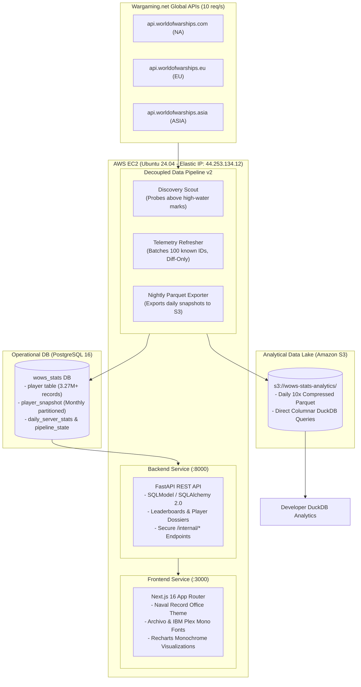

# World of Warships Stats Tracker — Naval Record Office

[](https://nextjs.org/)
[](https://fastapi.tiangolo.com/)
[](https://www.postgresql.org/)
[](https://duckdb.org/)
[](https://www.docker.com/)
[](https://aws.amazon.com/)

An AI-native, high-performance web platform and automated data pipeline for tracking and visualizing World of Warships player statistics, win rates, and combat performance across all major global servers (NA, EU, ASIA). Designed in authentic **Swiss Minimalist & WWII Admiralty Naval Record Office** editorial style.

---

## 🚀 Quick Reference Links (Production Server)

The application is deployed on a dedicated AWS EC2 instance backed by AWS RDS PostgreSQL in Oregon (`us-west-2`):

| Resource | URL / Access | Description |
| :--- | :--- | :--- |
| **Live Web App** | [http://44.253.134.12:3000](http://44.253.134.12:3000) | Next.js 16 Naval Record Office UI |
| **Fleet Leaderboards** | [http://44.253.134.12:3000/#leaderboard](http://44.253.134.12:3000/#leaderboard) | Global & Regional PvP Rankings |
| **Sample Dossier** | [http://44.253.134.12:3000/player/zmlzeze](http://44.253.134.12:3000/player/zmlzeze) | Verified Combat Telemetry Profile |
| **API Documentation (Swagger)** | [http://44.253.134.12:8000/docs](http://44.253.134.12:8000/docs) | Interactive Swagger UI / OpenAPI 3.0 |
| **API Health Check** | [http://44.253.134.12:8000/health](http://44.253.134.12:8000/health) | Uptime probe (`{"status":"healthy"}`) |
| **Leaderboard API** | [http://44.253.134.12:8000/api/leaderboard](http://44.253.134.12:8000/api/leaderboard) | Top commanders by WR, damage, battles |
| **Developer Runbook** | [`docs/RUNBOOK.md`](docs/RUNBOOK.md) | Operations, incident response, & DuckDB guides |

---

## 🏛 System Architecture: Hybrid Lakehouse



---

## 📊 Developer Tooling & Operations

### 1. Operations CLI
```bash
# Check container status and pipeline state
./scripts/ops.sh status

# Tail service logs
./scripts/ops.sh logs scraper
```

### 2. Developer Database Access
```bash
# Open secure SSH tunnel to private RDS (localhost:5433 -> RDS:5432)
./scripts/db.sh tunnel

# Connect via psql
./scripts/db.sh psql
```

### 3. DuckDB Lakehouse Analytics
```bash
# Run starter analysis against Parquet data lake
python scripts/analyze.py
```

For full operational procedures, secret rotation, and incident playbooks, refer to [`docs/RUNBOOK.md`](docs/RUNBOOK.md).
