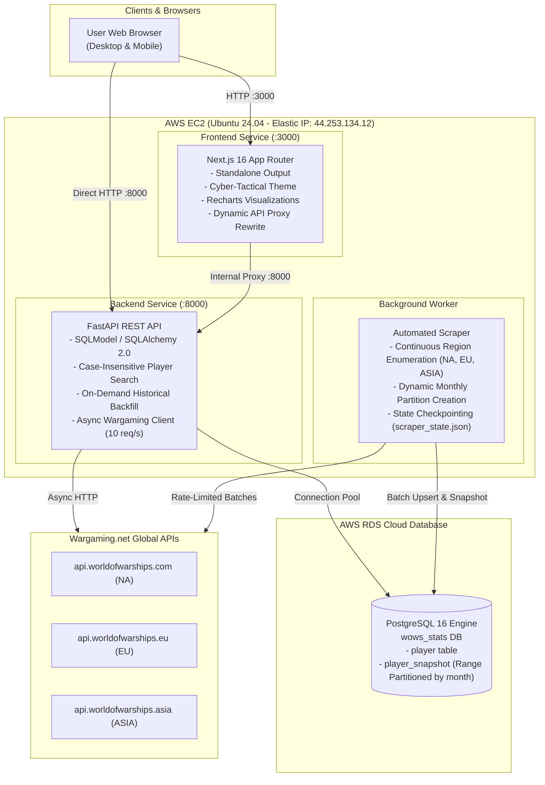

# World of Warships Stats Tracker (Neon Tactical Command)

[](https://nextjs.org/)
[](https://fastapi.tiangolo.com/)
[](https://www.postgresql.org/)
[](https://www.docker.com/)
[](https://aws.amazon.com/)
[](https://www.python.org/)

An AI-native, high-performance web platform and automated data pipeline for tracking and visualizing World of Warships player statistics, win rates, and combat performance across all major global servers (NA, EU, ASIA).

---

## 🚀 Quick Reference Links (Production Server)

The application is deployed on a dedicated AWS EC2 instance backed by AWS RDS PostgreSQL in Oregon (`us-west-2`):

| Resource | URL / Access | Description |
| :--- | :--- | :--- |
| **Live Web App** | [http://44.253.134.12:3000](http://44.253.134.12:3000) | Next.js 16 Cyberpunk/Neon Tactical UI |
| **API Documentation (Swagger)** | [http://44.253.134.12:8000/docs](http://44.253.134.12:8000/docs) | Interactive Swagger UI / OpenAPI 3.0 |
| **API Health Check** | [http://44.253.134.12:8000/health](http://44.253.134.12:8000/health) | Uptime probe (`{"status":"healthy"}`) |
| **Aggregate Overview API** | [http://44.253.134.12:8000/api/stats/overview](http://44.253.134.12:8000/api/stats/overview) | Global counter & player stats |
| **OpenAPI Schema** | [http://44.253.134.12:8000/openapi.json](http://44.253.134.12:8000/openapi.json) | Full OpenAPI JSON specification |
| **Production SSH** | `ssh -i ~/.ssh/wows-stats-ec2-key.pem ubuntu@44.253.134.12` | Direct server operations |

---

## 🏛 System Architecture

The modernized system uses a containerized multi-tier microservice architecture deployed via Docker Compose on AWS EC2, connected to AWS RDS PostgreSQL.



---

## 📊 Data Schema & Storage Architecture

The database utilizes **PostgreSQL 16 native range partitioning** on timestamps to efficiently store years of high-volume player history without table bloat.

### 1. `player` Table
Stores basic account metadata and caching timestamps.

| Column | Type | Constraints | Description |
| :--- | :--- | :--- | :--- |
| `account_id` | BIGINT | PRIMARY KEY | Unique Wargaming player ID |
| `nickname` | VARCHAR | INDEXED | In-game player handle |
| `realm` | VARCHAR | INDEXED | Server region (`na`, `eu`, `asia`) |
| `last_updated` | TIMESTAMP WITH TIME ZONE | | Last sync timestamp with WG API |
| `created_at` | TIMESTAMP WITH TIME ZONE | | Account discovery timestamp |

### 2. `player_snapshot` (Partitioned Table)
Stores daily cumulative performance snapshots. Partitioned by `RANGE (timestamp)` monthly.

| Column | Type | Constraints | Description |
| :--- | :--- | :--- | :--- |
| `account_id` | BIGINT | COMPOSITE PK (foreign key to `player`) | Player account ID |
| `timestamp` | TIMESTAMP WITH TIME ZONE | COMPOSITE PK | Snapshot recording date/time |
| `battles` | INTEGER | | Total battles fought |
| `wins` | INTEGER | | Total victories |
| `damage_dealt` | BIGINT | | Total cumulative damage |
| `survived` | INTEGER | | Total survived battles |
| `frags` | INTEGER | | Total enemy warships destroyed |
| `xp` | BIGINT | | Cumulative experience earned |

*Partitions are created on demand per month (e.g. `player_snapshot_2026_10` for October 2026).*

---

## ⚡ REST API Specification

### `GET /health`
Returns service status.
```json
{
  "status": "healthy"
}
```

### `GET /api/stats/overview`
Aggregated statistics displayed on the homepage dashboard.
```json
{
  "totalPlayers": 1420,
  "totalBattles": 5120349,
  "avgWinRate": 52.34,
  "status": "online"
}
```

### `GET /api/player/{username}`
Retrieves player profile and historical performance data for charting. If player is not cached in the local database, automatically resolves via Wargaming API and seeds up to 28 days of historical data via `statsbydate`.
```json
{
  "username": "zmlzeze",
  "accountId": 1008331251,
  "realm": "na",
  "lastUpdated": "2026-10-01T12:00:00Z",
  "stats": {
    "battles": 3143,
    "winRate": 55.42,
    "avgDamage": 67811,
    "survived": 1356,
    "frags": 3612,
    "xp": 3923528
  },
  "history": [
    {
      "date": "2026-09-01",
      "battles": 3100,
      "winRate": 55.2,
      "avgDamage": 67500
    }
  ]
}
```

---

## 💻 Local Development Quickstart

### Prerequisites
- Docker & Docker Compose **OR** Python 3.11+ & Node.js 20+

### Option A: Run with Docker Compose (Recommended)
```bash
# 1. Clone repository
git clone https://github.com/WilliamOnVoyage/World-of-Warships-Stats-Analysis.git
cd World-of-Warships-Stats-Analysis

# 2. Configure backend environment
cp backend/.env.example backend/.env
# Edit backend/.env to include your WARGAMING_APP_ID

# 3. Start all services
docker compose up --build
```
- Frontend: `http://localhost:3000`
- Backend API: `http://localhost:8000`
- Interactive Docs: `http://localhost:8000/docs`

### Option B: Run Standalone Services

#### 1. Backend
```bash
cd backend
python3 -m venv .venv
source .venv/bin/activate
pip install -e .
pip install pytest pytest-asyncio pytest-mock httpx python-dotenv

# Run tests
pytest

# Start development server
uvicorn main:app --reload --port 8000
```

#### 2. Frontend
```bash
cd frontend
npm ci

# Run linter and tests
npm run lint
npm run test

# Start Next.js development server
npm run dev
```

---

## 🛠 Testing & CI/CD

Continuous integration runs automatically on every commit and pull request to `master` via GitHub Actions:
- **Backend:** Python 3.11 environment running `pytest` with async mocks.
- **Frontend:** Node 20 environment running ESLint (`npm run lint`), Jest (`npm run test`), and Next.js standalone build (`npm run build`).

To run the full suite locally:
```bash
# Backend tests
(cd backend && source .venv/bin/activate && pytest)

# Frontend tests & build
(cd frontend && npm run lint && npm run test && npm run build)
```

---

## 📜 License & Acknowledgements
- Distributed under the Apache 2.0 License.
- Data provided by the official [Wargaming.net Developer Room](https://developers.wargaming.net/).
